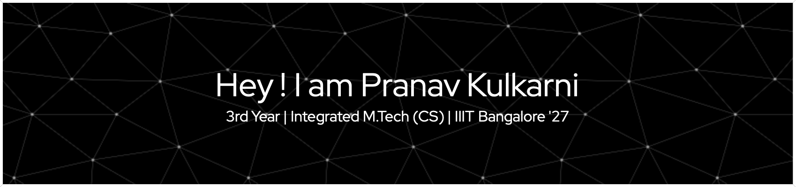

<!--
**py-xis/py-xis** is a ✨ _special_ ✨ repository because its `README.md` (this file) appears on your GitHub profile.

Here are some ideas to get you started: 

- 🔭 I’m currently working on ...
- 🌱 I’m currently learning ...
- 👯 I’m looking to collaborate on ...
- 🤔 I’m looking for help with ...
- 💬 Ask me about ...
- 📫 How to reach me: ...
- 😄 Pronouns: ...
- ⚡ Fun fact: ...
-->

  

- 🌱 I’m currently learning **Machine Learning**

- 👨‍💻 You can see all of my projects on   <a href = "https://github.com/py-xis">   GitHub </a>

- 📫 You can get in touch with me on  <a href="https://linkedin.com/in/pranav-kulkarni-867714255"> LinkedIn</a>

<h3 align="center">Some of my projects.</h3>

<h4>Development Related</h4>

- **Ditto - A Cross Platform Shared Clipboard System**
  - 

- **Online Library Management System**
  - Implemented an online library management system in C.
  - Implemented concurrency using socket programming and mutual exclusion with threads, leveraging concepts from operating systems.

- **LineAL**
  - Tech Stack : Flutter
  - Created an Android application capable of performing a wide range of computations related to linear algebra.
  - Technologies Used: Flutter.
 
- **Photo Editor**
  - Tech Stack : Java, C++.
  -  Developed a high-performance photo editor application in C++ and Java, utilizing Object-Oriented Programming (OOP) principles.Implemented diverse features such as Gaussian Blur, grayscale conversion,             dominant color detection, and image brightening.
  

<h3 align="center">Languages and Tools:</h3>

  
  
  
  
  
  
  
  
  
  
  
  
  
  
  
  

** **

<h3 align="center">Connect with me:</h3>

  
  &nbsp;&nbsp;&nbsp;
  
  &nbsp;&nbsp;&nbsp;
  
  &nbsp;&nbsp;&nbsp;
  
  &nbsp;&nbsp;&nbsp;
  

